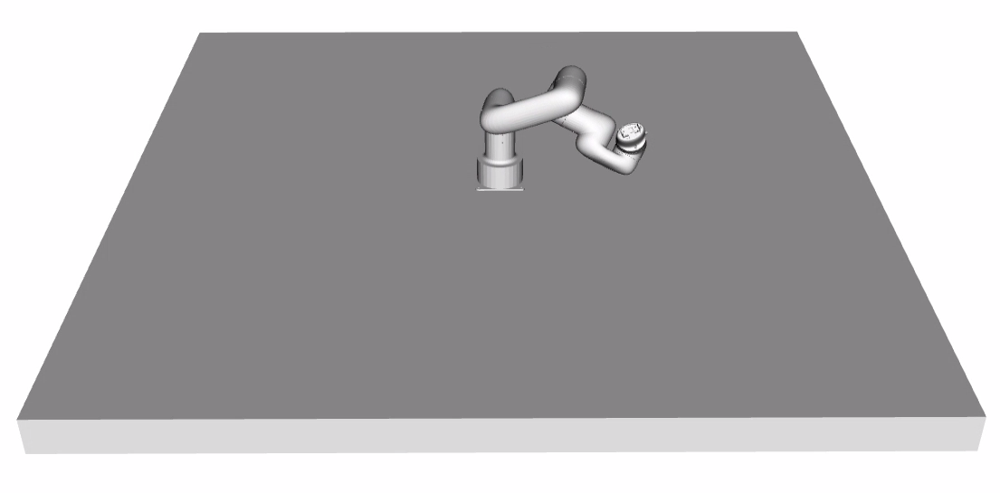

# MoveIt2 Demo Client

A [MoveIt2](https://moveit.picknik.ai/main/index.html) C++ client which can plan and execute to random or provided pose goals. The client makes use of the [`MoveGroupInterface`](https://docs.ros.org/en/noetic/api/moveit_ros_planning_interface/html/classmoveit_1_1planning__interface_1_1MoveGroupInterface.html) class making it compatible with various robot arms.

<br>

<center>



</center>

## Build

### Docker
The easiest way to build and run the demo client is using Docker. Follow the instructions [HERE](../../README.md#docker-build) to build a Docker image.

Once built refer to the examples [HERE](../../README.md#docker) to start a suitable container.

### Native
Refer to the instructions [HERE](../../README.md#native-build) to build the demo client and required dependencies natively from source.

## Usage

The demo client comes with some example launch files supporting both the [UFACTORY Lite 6](https://github.com/xArm-Developer/xarm_ros2/tree/rolling/xarm_moveit_config) and [Yaskawa MH24 MoveIt](../../yaskawa_mh24_moveit_config/README.md) configurations.

### Runtime Arguments

| Argument | Description |
| --- | --- |
| `random` | Generate random valid pose goals for a given robot description. Set to `false` if you want to control the robot using [`Pose`](https://docs.ros.org/en/rolling/p/geometry_msgs/msg/Pose.html) messages (Default: `true`)|
| `planning_group` | The MoveIt [`MoveGroup`](https://moveit.picknik.ai/main/doc/concepts/move_group.html) to use |

### Yaskawa MH24

Below is a list of launch arguments for the Yaskawa MH24 example.

| Argument | Description |
| --- | --- |
| `random` | Generate random valid pose goals to plan and execute. Set to `false` if you want to control the robot using [`Pose`](https://docs.ros.org/en/rolling/p/geometry_msgs/msg/Pose.html) messages (Default: `true`)|
| `prefix` | Identifier to prepend to node names to support multiple instances |
| `use_mock_hardware` | Set to `false` if you wish to run with fake hardware controllers. Set to `true` if you wish to use the [FPGA Drive-on-Chip Control Driver](../../fpga_doc_control_driver/README.md) (Default: `false`) |
| `use_rviz` | Set to `false` if you wish to run in headless mode or you plan to run RViz on a different device. Set to `true` if you wish to load RViz (Default: `false`) |

An example to run the demo client using fake hardware with RViz visualization:
```
ros2 launch moveit_demo_client mh24_moveit_demo.launch.py random:=true use_mock_hardware:=true use_rviz:=true
```

An example to run the demo client using [FPGA Drive-on-Chip](../../fpga_doc_control_driver/README.md) motor control in headless mode:
```
ros2 launch moveit_demo_client mh24_moveit_demo.launch.py random:=true use_mock_hardware:=false use_rviz:=false
```

### UFACTORY Lite 6

Below is a list of launch arguments for the UFACTORY Lite 6 example.

| Argument | Description |
| --- | --- |
| `random` | Generate random valid pose goals to plan and execute. Set to `false` if you want to control the robot using [`Pose`](https://docs.ros.org/en/rolling/p/geometry_msgs/msg/Pose.html) messages (Default: `true`)|
| `prefix` | Identifier to prepend to node names to support multiple instances |
| `mode` | Set to `fake` if you wish to run with fake hardware controllers. Set to `real` if you wish to use a physical Lite 6 robot arm. Set to `doc` if you wish to use the [FPGA Drive-on-Chip Control Driver](../../fpga_doc_control_driver/README.md) (Default: `fake`) |
| `robot_ip` | IP address of the physical robot arm (required if `mode` is set to `real`) |
| `use_rviz` | Set to `false` if you wish to run in headless mode or you plan to run RViz on a different device. Set to `true` if you wish to load RViz (Default: `false`) |

An example to run the demo client using fake hardware with RViz visualization:
```
ros2 launch moveit_demo_client lite6_moveit_demo.launch.py random:=true mode:=fake use_rviz:=true
```

An example to run the demo client using [FPGA Drive-on-Chip](../../fpga_doc_control_driver/README.md) motor control in headless mode:
```
ros2 launch moveit_demo_client lite6_moveit_demo.launch.py random:=true mode:=doc use_rviz:=false
```

An example to run the demo client with a real Lite 6 robot arm (ensure you substitute the IP address with the correct one for your device):
```
ros2 launch moveit_demo_client lite6_moveit_demo.launch.py random:=true mode:=real robot_ip:=192.168.1.158
```

## Control

The demo client is capable of generating random pose goals for a given `MoveGroup` or listening for [`Pose`](https://docs.ros.org/en/rolling/p/geometry_msgs/msg/Pose.html) messages on the `/moveit_demo_client/pose` topic.

An example of publishing a [`Pose`](https://docs.ros.org/en/rolling/p/geometry_msgs/msg/Pose.html) message from the command-line:
```
ros2 topic pub --once /moveit_demo_client/pose geometry_msgs/Pose "{position: {x: 0.2, y: 0.1, z: 0.3}, orientation: {x: 0.0, y: 0.0, z: 0.0, w: 1.0}}"
```