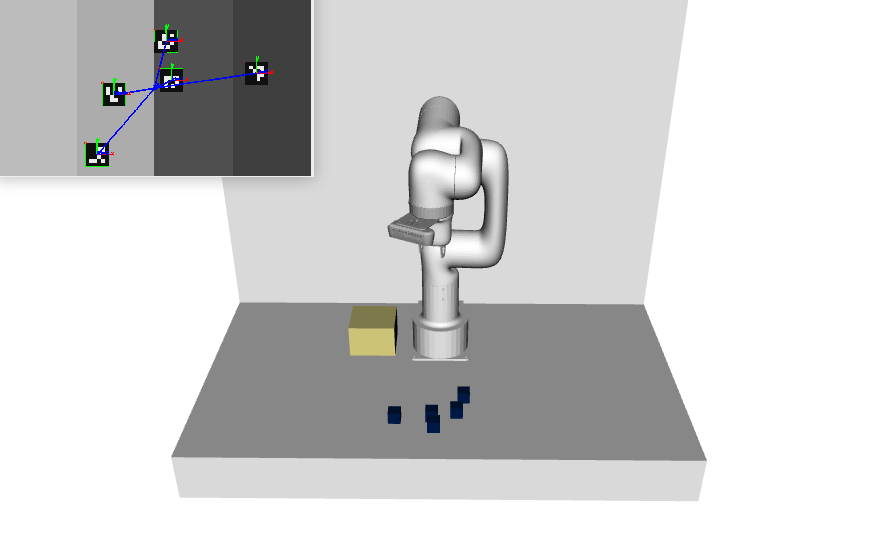
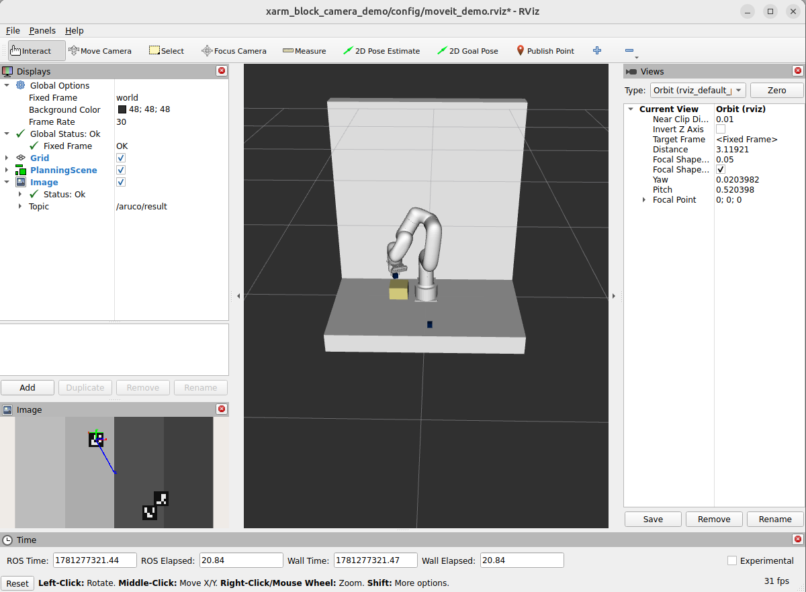

# xArm Block Camera Demo

A camera based pick & place demo supporting the [UFactory Lite6](https://www.ufactory.cc/lite-6-collaborative-robot/) robot arm. The demo utilizes [ArUco marker detection](https://github.com/namo-robotics/aruco_markers) and [MoveIt2](https://moveit.picknik.ai/main/index.html) to detect, pick and place blocks.

<br>

<center>



</center>

## Usage

The demo is designed to be used with the [Robotics with Vision example design](https://github.com/altera-fpga/agilex-ed-robotics/tree/main/HPS_ISP_VIS_DOC3x2_ROBOTICS) which simulates a suitable camera stream in the FPGA and includes a 6-axis Drive-on-Chip instance for FPGA based motor control using simulated motor models.

It is highly recommended to use the official [Docker image](https://hub.docker.com/r/alterafpga/ros2) to run this demo.

Pull the Docker image with the following command:

```
docker pull alterafpga/ros2
```

Run the following command to start a container:

```
docker run -it --rm --network host --device /dev/uio0 --device /dev/uio1 --device /dev/uio2 --device /dev/uio3 --device /dev/uio4 --device /dev/uio5 alterafpga/ros2 bash
```

5 UIO devices are passed through to the container:
 * **0-1** are frame writer devices
 * **2** is the ArUco marker generator controller interface
 * **3-5** are Drive-on-Chip motor control interfaces

To launch the demo run the following command:

```
ros2 launch xarm_block_camera_demo lite6_simulated_client.launch.py
```

To visualize the demo output you need to launch `rviz2` on a machine capable of video output. It is recommended to use [Rocker](https://github.com/osrf/rocker) to run `RViz` in a container.

```
rviz2 -d xarm_block_camera_demo/config/moveit_demo.rviz
```

<br>

<center>



</center>