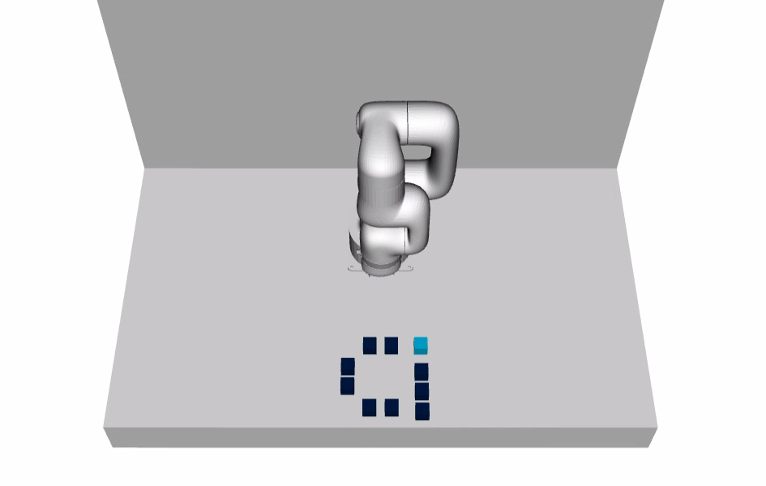
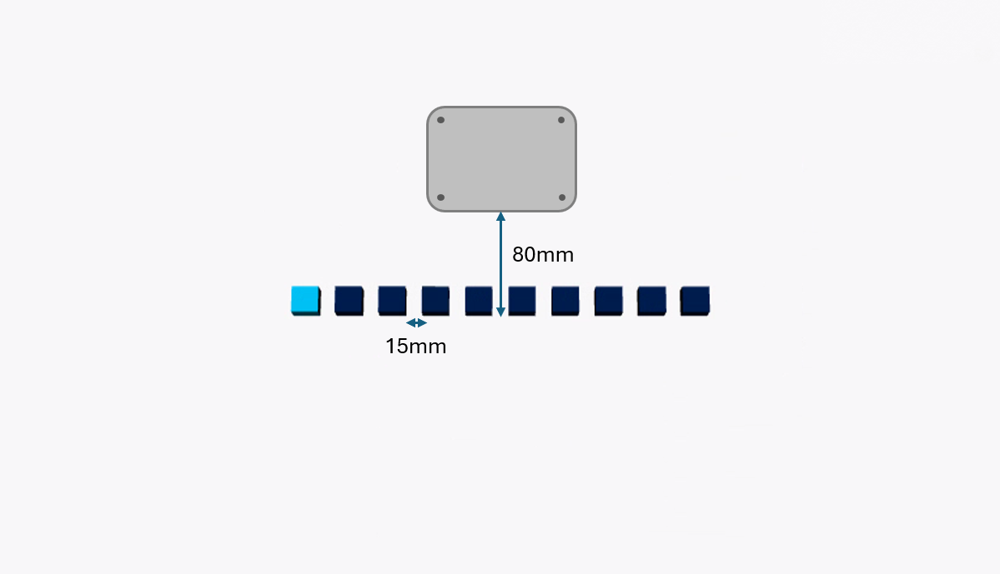

# xArm Block Demo

A pick & place demo supporting the [UFactory Lite6](https://www.ufactory.cc/lite-6-collaborative-robot/) robot arm. The demo utilizes [MoveIt2](https://moveit.picknik.ai/main/index.html) to create various patterns with blocks.

<br>

<center>



</center>

## Build

### Docker
The easiest way to build and run the demo client is using Docker. Follow the instructions [HERE](../../README.md#docker-build) to build a Docker image.

Once built refer to the examples [HERE](../../README.md#docker) to start a suitable container.

### Native
Refer to the instructions [HERE](../../README.md#native-build) to build the demo client and required dependencies natively from source.

## Usage

The demo package comes with some example launch files supporting various configurations including dual and single robot arms.

Below are some example launch commands for various configurations. Set `use_rviz:=false` to run in headless mode.

### Single Arm (Simulated)
```
ros2 launch xarm_block_demo lite6_fake_client.launch.py use_rviz:=true
```

### Single Arm (Real)
Ensure you enter the correct IP address for your robot arm.

```
ros2 launch xarm_block_demo lite6_client.launch.py use_rviz:=true robot_ip:=192.168.1.158
```

### Single Arm ([FPGA Drive-on-Chip](../../fpga_doc_control_driver/README.md))
```
ros2 launch xarm_block_demo lite6_doc_client.launch.py
```

### Dual Arms (Simulated)
```
ros2 launch xarm_block_demo dual_lite6_fake_client.launch.py use_rviz:=true
```

### Dual Arms (Real + Simulated)
Ensure you enter the correct IP address for your robot arm.

```
ros2 launch xarm_block_demo dual_lite6_client.launch.py use_rviz:=true robot_ip:=192.168.1.158
```

### Dual Arms ([FPGA Drive-on-Chip](../../fpga_doc_control_driver/README.md) + Simulated)

```
ros2 launch xarm_block_demo dual_lite6_fake_client.launch.py use_rviz:=false plugin_1:=fpga_doc_control_driver/DoCSystem
```

### Dual Arms (Real + [FPGA Drive-on-Chip](../../fpga_doc_control_driver/README.md))
Ensure you enter the correct IP address for your robot arm.

```
ros2 launch xarm_block_demo dual_lite6_client.launch.py use_rviz:=false robot_ip:=192.168.1.158 plugin_2:=fpga_doc_control_driver/DoCSystem
```

## Demo Setup
Below are instructions for setting up a physical demo using a UFACTORY Lite 6 robot arm.

### Requirements
* UFACTORY Lite 6 (Mounted to a suitable surface)
* Lite 6 Gripper Lite
* 50cm of clear space to the left, right and front of the robot arm.
* 1" square blocks x10

### Layout

The blocks should be placed **15mm** apart with the front face **80mm** from the front edge of the robot arm base plate as shown in the diagram below.

When the demo is first run the robot arm will do an alignment routine using the gripper to grab each block in turn before proceeding.

<br>

<center>



</center>

